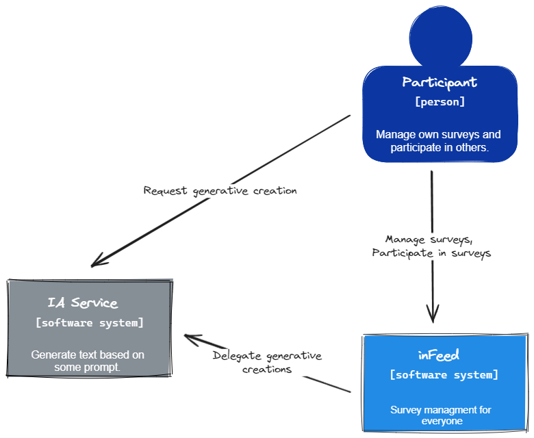
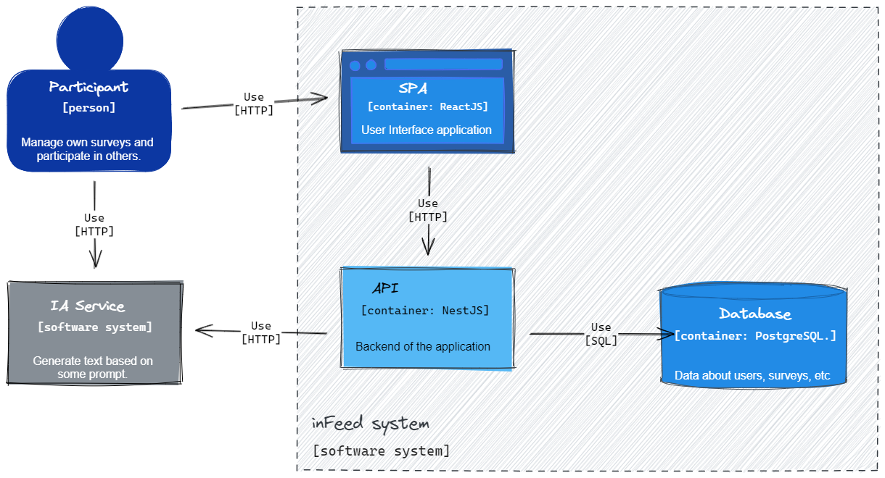
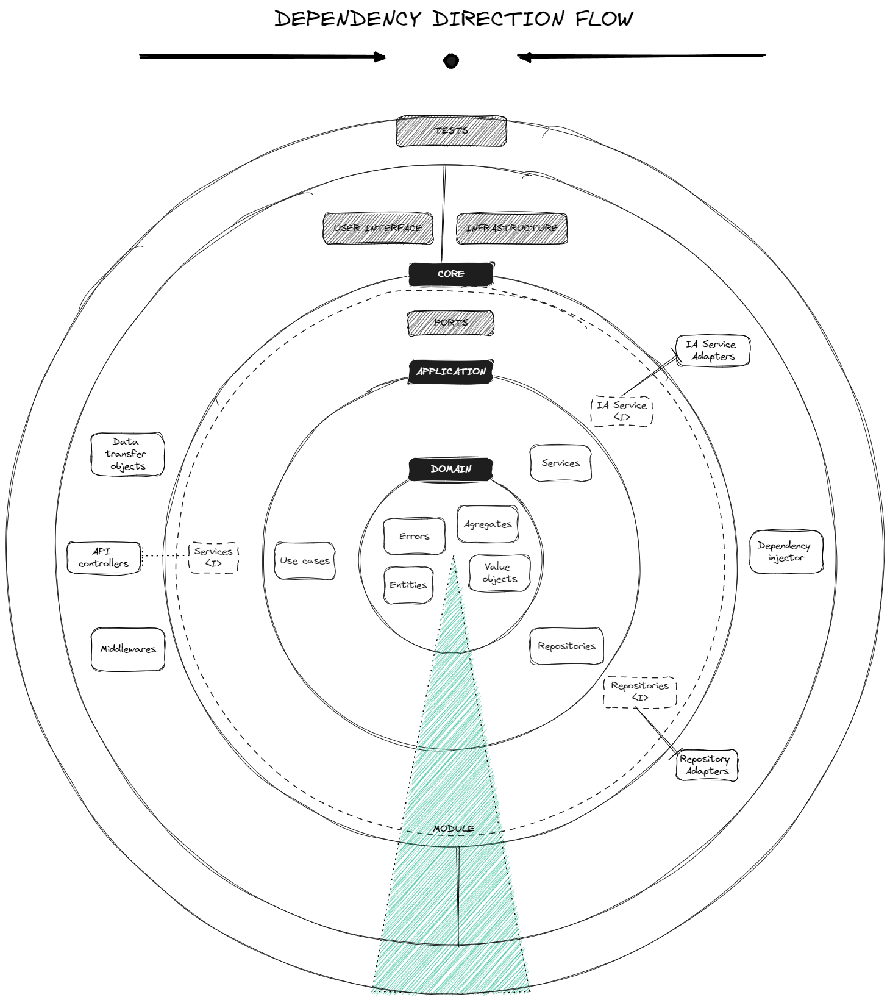
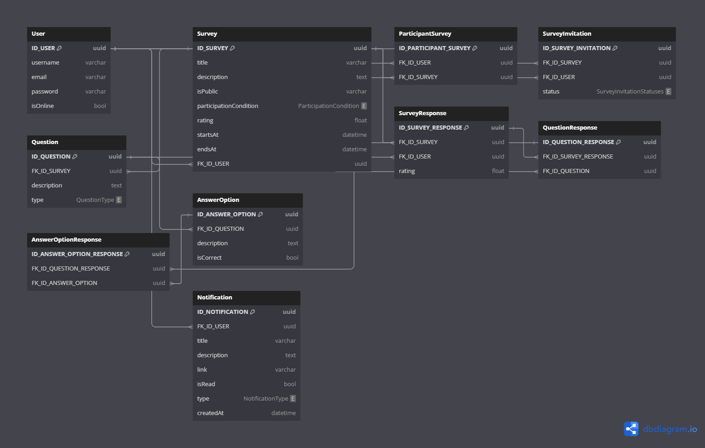

# inFeed

Plataforma de encuestas interactivas: Crea, comparte y participa en encuestas personalizadas con tu comunidad, equipo o amigos. Únete a encuestas públicas o privadas por invitación, contribuye y comparte tu opinión.

## Tabla de Contenido

[1. Introducción](#1-introducción)

[2. Dominio](#2-dominio)

[3. Análisis](#3-análisis)

&nbsp;&nbsp;&nbsp;&nbsp;[3.1. Casos de uso](#31-casos-de-uso)

&nbsp;&nbsp;&nbsp;&nbsp;[3.2. Dominio](#32-dominio)

[4. Arquitectura y diseño](#4-arquitectura-y-diseño)

&nbsp;&nbsp;&nbsp;&nbsp;[4.1. Modelo C4](#41-modelos-c4)

&nbsp;&nbsp;&nbsp;&nbsp;[4.2. Estructura general de módulos](#42-estructura-general-de-módulos)

&nbsp;&nbsp;&nbsp;&nbsp;[4.3. Base de datos](#43-base-de-datos)

&nbsp;&nbsp;&nbsp;&nbsp;[4.4. Seguridad](#44-seguridad)

&nbsp;&nbsp;&nbsp;&nbsp;[4.5. CI/CD](#45-cicd)

[5. Documentación](#5-documentación)

[6. Tecnologías](#6-tecnologías)

[7. Herramientas](#7-herramientas)

[8. Referencias](#8-referencias)

## 1. Introducción

En construcción.

## 2. Dominio

En construcción.

## 3. Análisis

En construcción.

### 3.1 Casos de uso

Diagramas de casos de uso para cada uno de los módulos del sistema, aquellas acciones que se encuentran con lineas discontinuas se especifican en un diagrama aparte para mejor comprensión, se recomienda revisar la documentación de cada uno de los módulos para obtener la mejor comprensión del sistema. [Ver detalles de los diagramas](./docs/use%20cases/detailed/ "Enlace hacia los diagramas de detalle").

#### 3.1.1. Modulo de Encuentas

")

#### 3.1.2. Modulo de Acceso de usuarios

")

### 3.2. Dominio

En construcción.

## 4. Arquitectura y diseño

En construcción.

### 4.1. Modelo C4

#### 4.1.1. Diagrama de Contexto

#### 4.1.2. Diagrama de Contenedores

#### 4.1.3. Diagrama de componentes (alto nivel)

")

#### 4.1.4. Diagrama de componentes (nivel de modulos)

")

### 4.2. Estructura general de módulos

### 4.3. Base de datos

_Pulsa la imagen para ver los scripts de la base de datos._

### 4.4. Seguridad

En construcción.

### 4.5. CI/CD

En construcción.

## 5. Documentación

En construcción.

## 6. Tecnologías

Tecnologías utilizadas para el funcionamiento del proyecto.

_Pulsa la insignia para visitar el sitio web oficial de la tecnología._

## 7. Herramientas

Herramientas auxiliares utilizadas para la construcción y mantenimiento del proyecto.

_Pulsa la insignia para visitar el sitio web oficial de la tecnología._

## 8. Referencias

Referencias a todo el material usado para la construcción de este proyecto, se otorgan los créditos correspondientes a cada fuente y sus autores correspondientes.

- [Monolitos modulares](https://github.com/kgrzybek/modular-monolith-with-ddd?tab=readme-ov-file#30-c4-model)
- [Las crónicas de la arquitectura de software](https://herbertograca.com/2017/07/03/the-software-architecture-chronicles/)
